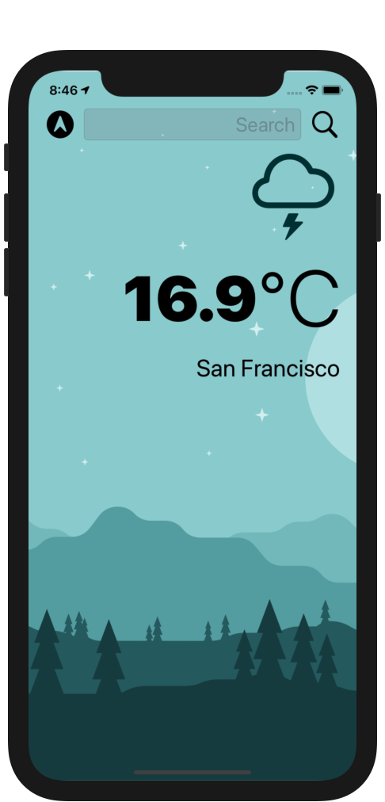
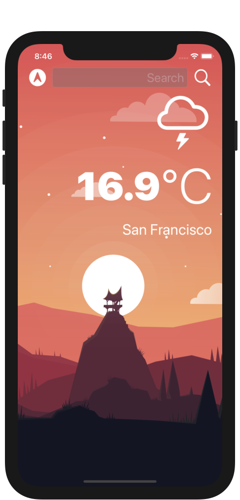
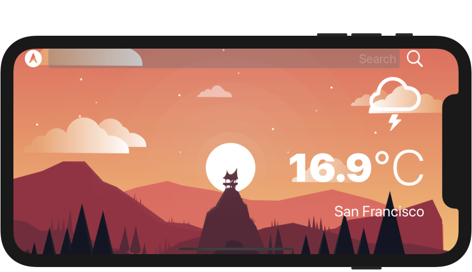
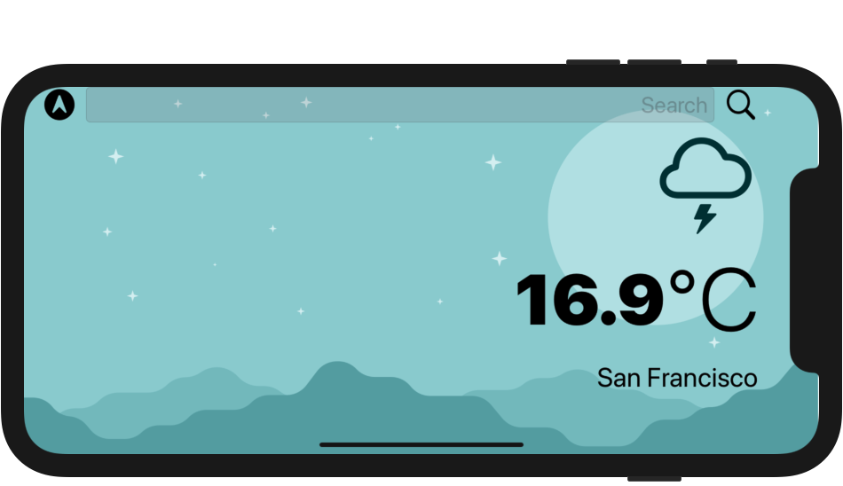
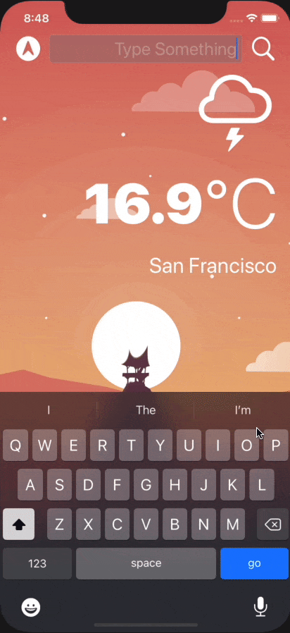

# Climate-App
### Screen Shots

---

### Table of Contents

- [Description](#description)
- [How To Use](#how-to-use)
- [Author Info](#author-info)

## Description

- Live weather app which fetches weather from openWeather API

---

### What I Learned:

- How to create a dark-mode enabled app.
- How to use vector images as image assets.
- Learn to use the UITextField to get user input.
- Learn about the delegate pattern.
- Swift protocols and extensions.
- Swift guard keyword.
- Swift computed properties.
- Swift closures and completion handlers.
- Learn to use URLSession to network and make HTTP requests.
- Parse JSON with the native Encodable and Decodable protocols.
- Learn to use Grand Central Dispatch to fetch the main thread.
- Learn to use Core Location to get the current location from the phone GPS.

---

## How To Use

- Clone the project and run it on Xcode
---

## Author Info
- Website - [LinkedIn: Gurpreet Singh](https://www.linkedin.com/in/gurpreet-singh-a2651b107/)

[Back To The Top](#Climate-App)
